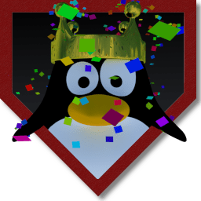
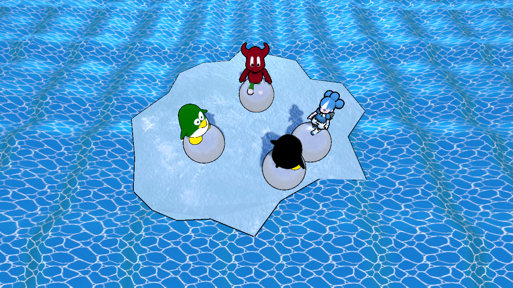

#  SuperTuxParty

A [free/libre](https://www.gnu.org/philosophy/free-sw.html) and
[open-source](https://opensource.org/docs/osd/) party game that is meant to
replicate the feel of games such as Mario Party.

## Download

You can download SuperTuxParty from [Itch.io](https://anti.itch.io/super-tux-party),our [website](https://supertux.party/download) or get it on [FlatHub](https://flathub.org/apps/details/party.supertux.supertuxparty).

</a>
    

## Engine

SuperTuxParty is built with the [Godot Engine](https://godotengine.org/).
Currently, Godot Engine version 4.2 is used.

## Issues

If you have ideas for mini-games, design improvements or have found a bug then
please report that under Issues.

## License

All code is licensed under the [GNU GPL V3.0](https://www.gnu.org/licenses/gpl.html) or, at your option, any later version.
See the [**LICENSE**](licenses/LICENSE) file for more information.

All other data such as art, sound, music, and etc. is released under a bunch
of different licenses.
See the [**LICENSE-ART**](licenses/LICENSE-ART.md) file, the [**LICENSE-MUSIC**](licenses/LICENSE-MUSIC.md) file, the [**LICENSE-SHADER**](licenses/LICENSE-SHADER.md) file and the [**LICENSE-FONTS**](licenses/LICENSE-FONTS.md) file for more details.

## Translation

All translation is done on [Hosted Weblate](https://hosted.weblate.org/projects/super-tux-party/)

## Community

We also have a [subreddit](https://www.reddit.com/r/SuperTuxParty/)
for discussions about the project, and two Matrix rooms for
[development](https://matrix.to/#/#SuperTuxParty-Dev:matrix.org) and
[general](https://matrix.to/#/#SuperTuxParty-Extra:matrix.org) talking.

[def]: https://downloads.tuxfamily.org/godotengine/3.2.2/